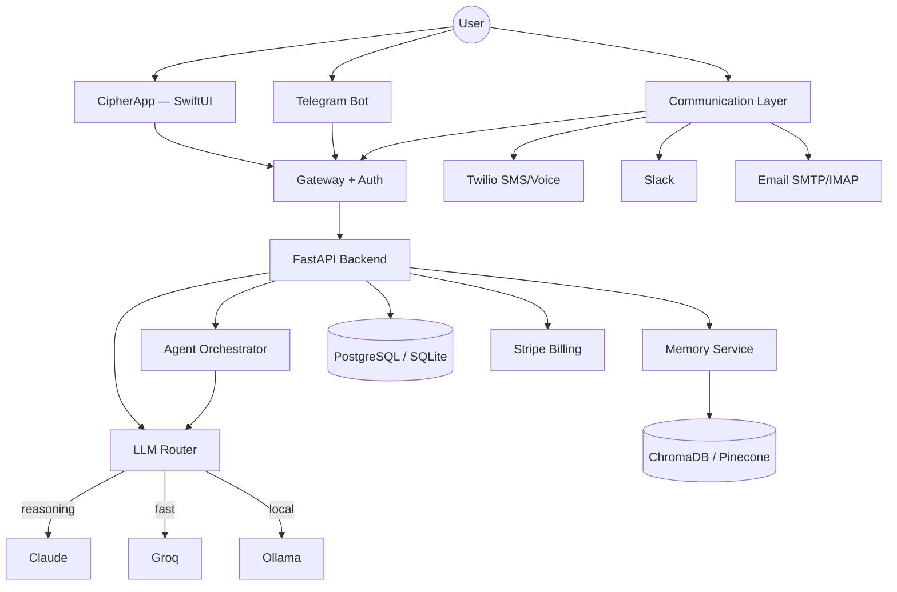

# Cipher

[](https://www.python.org/) [](https://fastapi.tiangolo.com/) [](https://developer.apple.com/xcode/swiftui/) [](LICENSE)

A multi-tenant AI platform combining a native iOS client, a multi-provider LLM orchestration backend, and a 30+ skill agent framework — with production billing, telephony, and messaging built in from day one.

Originally prototyped under the codename **Orchid** as a local LLM router and Telegram assistant, Cipher evolved into a full product: subscription billing through Stripe, a native SwiftUI mobile app, multi-channel communication (SMS, voice, Telegram, Slack, email), and an extensible agent system spanning trading, research, deployment, and scheduling.

## What it does

Cipher lets a user talk to a single assistant across multiple surfaces — iOS app, SMS, voice call, Telegram, Slack, or email — and have that assistant reason with the right model for the task, remember context long-term, and take real action through a library of specialized agents.

## Architecture



### Components

| Layer | Stack | What it does |
|-------|-------|--------------|
| **iOS App** (`CipherApp/`) | SwiftUI, 48 Swift files, TestFlight-ready | Chat, voice cloning/settings, agent dashboard, cron/scheduling UI, research, media generation, projects, account settings |
| **Backend** (`app/`) | FastAPI, Pydantic v2, SQLAlchemy/Alembic, Celery/Redis | 20+ routers for auth, billing, chat, cron, media, memory, models, research, scanner, swarm, tasks, voice |
| **Agent framework** | Typed `Agent` base class + registry + executor | Skill agents implement a common contract with validate/execute/verify lifecycle and approval gates |
| **Model routing** | LiteLLM | Routes requests across Claude, Groq/Llama, and local Ollama models by task type |
| **Memory** | ChromaDB + SQLite, Pinecone upgrade path | Vector-backed long-term memory seeded with operational playbooks |
| **Communication** | Twilio, Telegram, Slack, SMTP/IMAP | Unified `communication_agent` sends/receives across every channel under one user context |
| **Billing** | Stripe | Free / Pro ($29) / Business ($79) / Enterprise ($199) tiers, Checkout, Billing Portal, webhooks, tier-enforced routes |
| **Infra** | Docker, Railway, Fly.io, launchd, nginx | Production deployment configs, hardened Docker compose, background Celery workers |

## Key engineering decisions

- **Model tiering over a single model.** Routing by task type (reasoning, fast, code, local) rather than always calling the most expensive model trades cost and latency deliberately.
- **Unified agent interface.** Every skill (trading, comms, deploy, research) implements a common agent contract, so new capabilities plug into the same orchestration and permission layer.
- **Tier-gated everything.** Billing tier is enforced at the route and agent level, so upgrading a plan immediately changes what the assistant is allowed to do for that user.
- **Multi-channel, single identity.** A message via SMS, Telegram, or the iOS app resolves to the same user context and memory instead of being siloed per channel.

## Project structure

```text
.
├── app/                # FastAPI backend: API, agents, services, core, db, gateway
├── CipherApp/          # Native iOS client (SwiftUI)
├── dashboard/          # Standalone HTML dashboard served by the API
├── infra/              # Docker, nginx, launchd, and deployment scripts
├── tests/              # pytest suite
├── Dockerfile          # Multi-stage production image
├── docker-compose.yml  # Local + production orchestration
├── pyproject.toml      # Python project metadata
├── requirements.txt    # Production dependencies
├── start_cipher.sh     # Local startup script
├── deploy.sh           # One-command Railway deployment
└── README.md
```

## Quick start

### Backend

```bash
# 1. Clone and enter the repo
cd cipher

# 2. Create a Python virtual environment and install dependencies
python3 -m venv .venv
source .venv/bin/activate
pip install -r requirements.txt

# 3. Configure environment
cp .env.example .env
# Edit .env and add your API keys

# 4. Run the server
./start_cipher.sh
# or directly:
uvicorn app.main:app --host 0.0.0.0 --port 8000 --reload
```

Open `http://localhost:8000/docs` for the interactive API documentation.

### iOS app

```bash
cd CipherApp
xcodebuild -project CipherApp.xcodeproj -scheme CipherApp -destination 'platform=iOS Simulator,name=iPhone 16'
```

Or open `CipherApp/CipherApp.xcodeproj` in Xcode and run on a simulator or device.

## Testing

```bash
pytest
```

The test suite covers agent base classes, intent classification, registry routing, and core API endpoints.

## Deployment

- **Docker:** `docker compose up -d`
- **Railway:** `./deploy.sh`
- **Fly.io:** Uses `fly.toml` in repo root.

## Status

Actively developed. Core backend, agent framework, billing integration, and communication layer are functional; the iOS app is TestFlight-ready.

## Tech stack

- **Backend:** Python, FastAPI, Celery, SQLAlchemy, Alembic, Pydantic, Redis
- **Mobile:** Swift, SwiftUI, Combine
- **ML/AI:** LiteLLM, Anthropic Claude, Groq, Ollama, ChromaDB, Pinecone
- **Payments / Comms:** Stripe, Twilio
- **Infra:** Docker, Railway, Fly.io, launchd, nginx

## License

MIT License — see [LICENSE](LICENSE).
